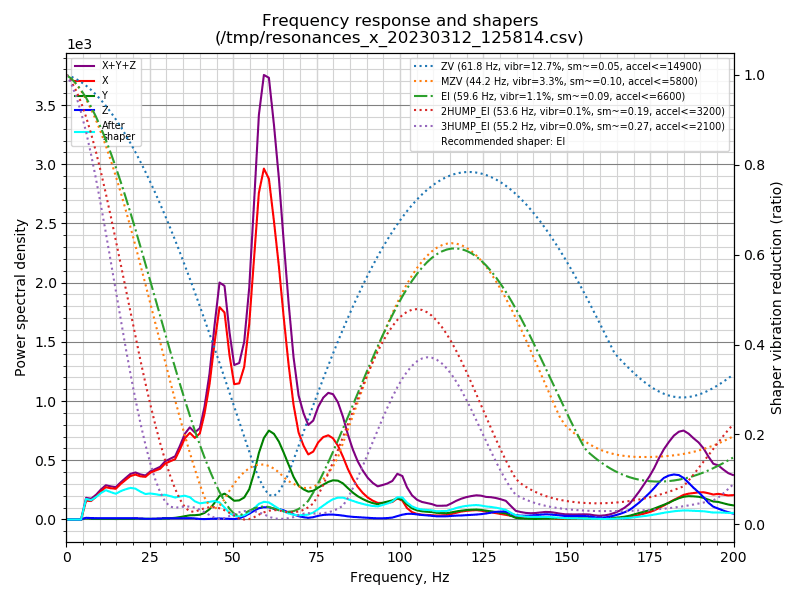
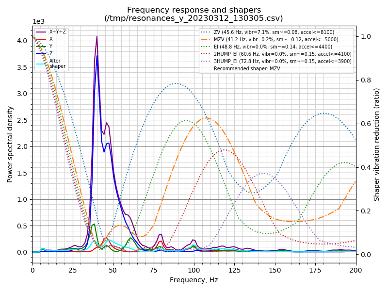
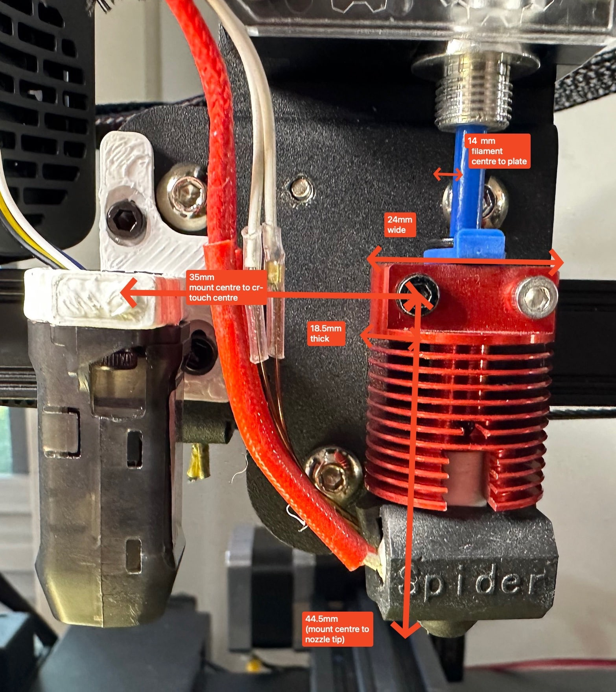

# Ender-3-V2-Neo

My Documentation, Configuration, Scripts and notes for the Ender 3 V2 Neo 3d Printer.

- [Ender-3-V2-Neo](#ender-3-v2-neo)
- [Sam's Ender 3 V2 Neo Setup](#sams-ender-3-v2-neo-setup)
  - [Hardware](#hardware)
    - [Upgrades](#upgrades)
      - [Future Upgrades](#future-upgrades)
      - [Previous Upgrades](#previous-upgrades)
    - [Connectivity](#connectivity)
  - [Firmware](#firmware)
    - [Custom Firmware Further Customisations](#custom-firmware-further-customisations)
    - [Formatting SD Cards](#formatting-sd-cards)
  - [Settings](#settings)
    - [Feedrate calibration](#feedrate-calibration)
      - [LDO Orbiter 2.0 Extruder](#ldo-orbiter-20-extruder)
      - [Stock Ender 3 v2 Neo Extruder](#stock-ender-3-v2-neo-extruder)
      - [E3D Titan Extruder](#e3d-titan-extruder)
  - [Resonance Testing](#resonance-testing)
  - [Creality Spider - Titan Version (2023)](#creality-spider---titan-version-2023)
  - [Software](#software)
    - [Prusa Slicer](#prusa-slicer)
    - [Cura](#cura)
    - [Material Settings](#material-settings)
    - [GCode scripts](#gcode-scripts)
    - [Octoprint](#octoprint)
  - [Failed print recovery](#failed-print-recovery)
    - [Webcam](#webcam)
  - [Links](#links)
  - [Author](#author)
  - [Images](#images)

# Sam's Ender 3 V2 Neo Setup

## Hardware

- Ender 3 v2 Neo

### Upgrades

- SKR Mini E3 V3
- Orbiter 2.0 Extruder
  - Orbiter 2.0 Filament Loader and Sensor
- Creality Spider Hotend (Titan kit version)
- Drive drive
- Dual Z Axis
- Cooling
  - 2x 5015 Blower fans for part cooling
  - 1x 4020 Fan for the hotend
  - 1x 80mm Fan for the PSU
- Replaced Neo X carriage mount with the Ender 3 V2 direct drive mount

#### Future Upgrades

Potential future upgrades

- [Squirrelf](https://t.co/BVAAPdqH7z)'s ApolloLander cooling <https://www.patreon.com/posts/apollolander-and-71090737>
- Klipper - Currently I'm using Marlin but I'm interested in trying Klipper
- ADXL345 accelerometer
- Belt driven Z Axis - <https://github.com/kevinakasam/BeltDrivenEnder3>
- Linear rails (expensive though!)

#### Previous Upgrades

I'm no longer using these upgrades, but I'm keeping them here for reference.

- E3D/Creality Titan Extruder
- Hero Me Gen 7
- Spider 1.0 Hot End

### Connectivity

- Klipper/Mainsail/Fluidd running on a RockPi 4 SE
- Webcam connected to RockPi with ustreamer
- Printer connected via USB
  - I did try removing the USB 5v pin as per <https://community.octoprint.org/t/put-tape-on-the-5v-pin-why-and-how/13574> but it caused the printer to not be detected, I ended up getting an adapter that removes the 5v pin cleanly.
  - udev rules for consistent USB device naming - when you reconnect a USB device it might get a different device name (e.g. `/dev/ttyUSB0` > `/dev/ttyUSB1` etc...) - this is annoying if you've configured your software such as Octoprint to use a specific device. As such you can create udev rules to ensure both the printer and any related webcams are always named consistently (e.g. `/dev/3dprinter`, `/dev/webcam` etc...) [octoprint/`99-3d-printer.rules`](octoprint/99-3d-printer.rules).

## Firmware

I have settled on using @mriscoc's Firmware for the Ender 3 V2.

It is based on the Marlin firmware but has a number of optimisations for the Ender 3 V2 Neo and is well suited to Octoprint.

- [mriscoc/Ender3V2S1](https://github.com/mriscoc/Ender3V2S1)
- [How to install the firmware](https://github.com/mriscoc/Ender3V2S1/wiki/How-to-install-the-firmware)

Note: To store the mesh and other settings on the printer you must leave a SD plugged in, otherwise when you restart the printer it will return to the firmware defaults.

### Custom Firmware Further Customisations

- See [firmware](firmware/README.md)

### Formatting SD Cards

Make sure you format your SD card with 4096 byte sector size or it may not flash correctly.

Format a SDCard with 4096 byte sector size in macOS

```shell
diskutil list # Find the SDCard you want to format

diskutil info disk4s1 # Get the current SDCard info, assuming the disk is disk4s1
sudo newfs_msdos -F 32 -b 4096 disk4s1 # Format the SDCard as FAT32 with a 4096 byte sector size, assuming the disk is disk4s1
```

## Settings

- Bed size (printable)
  - X: 225mm
  - Y: 225mm
- Bed size (max)
  - X: 244mm
  - Y: 230mm

### Feedrate calibration

#### LDO Orbiter 2.0 Extruder

```cfg
[extruder]
# orbiter motor LDO-36STH20-1004AHG(XH)
rotation_distance: 4.576 # calibrated 2023-03-12
microsteps: 16
full_steps_per_rotation:   200
min_extrude_temp: 180
max_extrude_only_distance: 500
max_extrude_only_velocity: 120      # <- for orbiter motor LDO-36STH20-1004AHG(XH)
max_extrude_only_accel:    800      # <- for orbiter motor LDO-36STH20-1004AHG(XH)
step_pin: PB3
dir_pin: !PB4
enable_pin: !PD1
microsteps: 16
nozzle_diameter: 0.600
filament_diameter: 1.750
heater_pin: PC8
sensor_type: EPCOS 100K B57560G104F # maybe try ATC Semitec 104GT-2
sensor_pin: PA0
#control: pid
#pid_Kp: 21.527
#pid_Ki: 1.063
#pid_Kd: 108.982
min_temp: 0
max_temp: 270
#PA values
#PLA+ eSun:
pressure_advance: 0.025    # to be calibrated
pressure_advance_smooth_time: 0.03  # to be calibrated

[tmc2209 extruder]
interpolate: true
uart_pin: PC11
tx_pin: PC10
uart_address: 3
## orbiter motor LDO-36STH20-1004AHG(XH)
run_current:    0.850 # RMS <- for orbiter motor LDO-36STH20-1004AHG(XH)
hold_current:   0.1
sense_resistor: 0.11
stealthchop_threshold: 0
driver_TBL: 0
driver_HEND: 6
driver_HSTRT: 7
driver_TOFF: 4
```

#### Stock Ender 3 v2 Neo Extruder

Note: _Legacy/historical information._

(95.5+96.2+96.4)/3=96.033 = Extrusion multiplier: 1.04

Current estep: 93 = E step multiplier found before: 1.04

New estep value: 96.7, (repeat)

- Feedrate (calibrated at the extruder (aka cold calibration): 95.7mm/s

#### E3D Titan Extruder

Note: _Legacy/historical information._

Creality Titan Kit

- Final estep value: 406.0

## Resonance Testing




```plain
/usr/share/klipper/scripts/calibrate_shaper.py /tmp/resonances_x_*.csv -o /tmp/shaper_calibrate_x.png
Fitted shaper 'zv' frequency = 61.8 Hz (vibrations = 12.7%, smoothing ~= 0.047)
To avoid too much smoothing with 'zv', suggested max_accel <= 14900 mm/sec^2
Fitted shaper 'mzv' frequency = 44.2 Hz (vibrations = 3.3%, smoothing ~= 0.104)
To avoid too much smoothing with 'mzv', suggested max_accel <= 5800 mm/sec^2
Fitted shaper 'ei' frequency = 59.6 Hz (vibrations = 1.1%, smoothing ~= 0.091)
To avoid too much smoothing with 'ei', suggested max_accel <= 6600 mm/sec^2
Fitted shaper '2hump_ei' frequency = 53.6 Hz (vibrations = 0.1%, smoothing ~= 0.188)
To avoid too much smoothing with '2hump_ei', suggested max_accel <= 3200 mm/sec^2
Fitted shaper '3hump_ei' frequency = 55.2 Hz (vibrations = 0.0%, smoothing ~= 0.269)
To avoid too much smoothing with '3hump_ei', suggested max_accel <= 2100 mm/sec^2
Recommended shaper is ei @ 59.6 Hz

/usr/share/klipper/scripts/calibrate_shaper.py /tmp/resonances_y_*.csv -o /tmp/shaper_calibrate_y.png
Fitted shaper 'zv' frequency = 45.6 Hz (vibrations = 7.1%, smoothing ~= 0.080)
To avoid too much smoothing with 'zv', suggested max_accel <= 8100 mm/sec^2
Fitted shaper 'mzv' frequency = 41.2 Hz (vibrations = 0.2%, smoothing ~= 0.120)
To avoid too much smoothing with 'mzv', suggested max_accel <= 5000 mm/sec^2
Fitted shaper 'ei' frequency = 48.8 Hz (vibrations = 0.0%, smoothing ~= 0.135)
To avoid too much smoothing with 'ei', suggested max_accel <= 4400 mm/sec^2
Fitted shaper '2hump_ei' frequency = 60.6 Hz (vibrations = 0.0%, smoothing ~= 0.147)
To avoid too much smoothing with '2hump_ei', suggested max_accel <= 4100 mm/sec^2
Fitted shaper '3hump_ei' frequency = 72.8 Hz (vibrations = 0.0%, smoothing ~= 0.155)
To avoid too much smoothing with '3hump_ei', suggested max_accel <= 3900 mm/sec^2
Recommended shaper is mzv @ 41.2 Hz
```

## Creality Spider - Titan Version (2023)

The Spider hot end that comes with the Titan extruder kit is a bit different from the v1 and v3 spider.

Note: The carriage plate pictured here is NOT the Neo version! It's from a Ender 3 v2 (non-neo).



## Software

### Prusa Slicer

- Running the [latest beta/alpha version](https://github.com/prusa3d/PrusaSlicer/releases).
- See [prusa-slicer](prusa-slicer).

Output Options

```shell
/Users/samm/bin/ArcWelder --g90-influences-extruder;
```

### Cura

- [Ultimaker Cura](https://ultimaker.com/software/ultimaker-cura).
- See [cura/profiles](legacy/cura/profiles)

_Note: Creality's own '[Creality Slicer](https://www.creality.com/pages/download-ender-3-v2-neo)' software is a fork of [Cura](https://ultimaker.com/software/ultimaker-cura) and is often lagging behind Cura versions._

### Material Settings

- PLA+ (eSun, yxpolyer)
  - Extruder Temperature: 206°C
    - Initial Layer Temperature: 210°C
  - Platform Temperature: 65°C
    - Initial Layer Temperature: 74°C

### GCode scripts

- See [klipper/cfg-macros](klipper/cfg-macros)
- See [legacy/gcodes](legacy/gcodes) (old)

### Octoprint

_Note: I'm in the process of switching from OctoPrint + Marlin to Klipper + Mainsail / Fluidd with [kiauh](https://github.com/th33xitus/kiauh)._

- Historical octoprint [octoprint/docker-compose.yml](legacy/octoprint/docker-compose.yml) NO LONGER USED.

## Failed print recovery

I've created a GCODE template that can be used to recover/resume from a failed print.

- See [legacy/gcodes/manual-print-recovery.gcode](legacy/gcodes/manual-print-recovery.gcode)

### Webcam

Webcam Settings

- Stream URL: `http://192.168.0.12:8002/stream?extra_headers=1`
- Snapshot URL: `http://192.168.0.12:8002/snapshot`
- Path to FFMPEG: `/usr/bin/ffmpeg`

## Links

- <https://github.com/mriscoc/Ender3V2S1>
- <https://github.com/Lash-L/Ender-3-V2-Neo-Setup>
- <https://github.com/norpchen/ProcessGCode>
- <https://www.reddit.com/r/Ender3V2NEO/comments/zaxivx/creality_ender_3_v2_neo_modification_and_upgrade/>

## Author

Sam McLeod

[smcleod.net](https://smcleod.net)

## Images

v4.2.2 (and v4.2.7) motherboard diagram (upscaled using ML Super Resolution)


